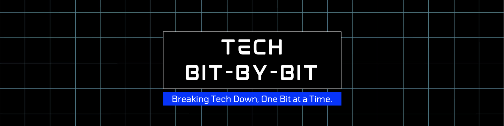

# Tech Bit-by-Bit

**Tech Bit-by-Bit** is a content-driven Next.js site designed to break down technology concepts in a friendly, visual, and human-centered way. It’s a safe space for beginners, the tech-curious, and anyone who’s ever felt overwhelmed by jargon.

This project powers a blog, YouTube channel, and podcast aimed at making tech more approachable — one bit at a time.

---

## Features & Credit

This site is built on the excellent [Tailwind Next.js Starter Blog v2](https://github.com/timlrx/tailwind-nextjs-starter-blog) by [@timlrx](https://github.com/timlrx), which has been **heavily customized** for the **Tech Bit-by-Bit** brand and mission.

### Tech Stack & Customizations

- Built with **Next.js 15** and **Tailwind CSS v4**
- Uses **Contentlayer** for managing Markdown/MDX content
- Custom fonts: _Orbitron_ (headings) and _Work Sans_ (body)
- Personalized color palette and typography
- Light & dark mode with toggle functionality
- Responsive design with accessibility in mind
- SEO-friendly and performance optimized
- **Like button** added for individual posts
- **Comments** added for individual posts powered by **Cusdis**
- **Authentication** and user handling via **Clerk** added
- Additional component styling and layout refinements
- Middleware added
- Updated to use esNext for modules

---
